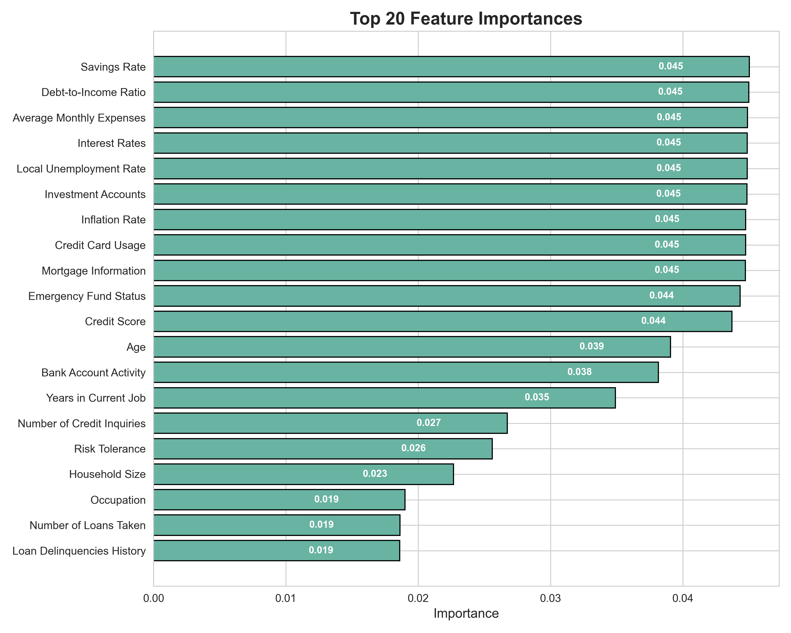

# 💼 Financial Risk Profile Prediction

This project aims to predict the **financial risk profile** of individuals using demographic, financial, and life event data. The model classifies individuals into three categories:
- 🟢 **Healthy**
- 🟠 **Moderate Risk**
- 🔴 **High Risk**

---

## 📁 Project Structure

```
financial_risk_predictor/
├── data/
│   ├── train.csv
│   └── test.csv
├── models/
│   └── model.pkl
├── outputs/
│   ├── metrics.json
│   └── plots/
│       └── feature_importance_cleaned.png
├── src/
│   ├── config.py
│   ├── preprocess.py
│   ├── train.py
│   ├── evaluate.py
│   ├── explain.py
│   └── plot_feature_importance.py
├── main.py
└── requirements.txt
```

---

## ⚙️ How to Run

1. ✅ Install dependencies:
   ```bash
   pip install -r requirements.txt
   ```

2. ✅ Run the full pipeline:
   ```bash
   python main.py
   ```

3. ✅ To generate the feature importance plot:
   ```bash
   python src/plot_feature_importance.py
   ```

---

## 📊 Output

- `model.pkl`: Trained Random Forest model.
- `metrics.json`: Classification report and accuracy score.
- `feature_importance_cleaned.png`: Top 20 features ranked by importance (using `RandomForestClassifier.feature_importances_`).



---

## 🧠 Model Explainability

Instead of SHAP, we used the built-in `feature_importances_` from `RandomForestClassifier` to rank key predictors of financial risk. This method is fast, interpretable, and suitable for structured tabular data.

---

## 🛠 Technologies Used

- Python
- pandas, numpy, scikit-learn
- matplotlib, seaborn
- joblib

---

## 📌 Notes

- Dataset contains 100,000 synthetic individuals with 40+ financial and demographic features.
- Target: `Risk Profile` (0 = Healthy, 1 = Moderate Risk, 2 = High Risk).
- Feature importances help explain model decisions in a lightweight manner.

---

## 📬 Contact

**Thasniem Fathima J**  
📧 thfjd7865@gmail.com  
🔗 [GitHub](https://github.com/Thasniem) | [LinkedIn](https://www.linkedin.com/in/thasniem-fathima-engineering-student)
